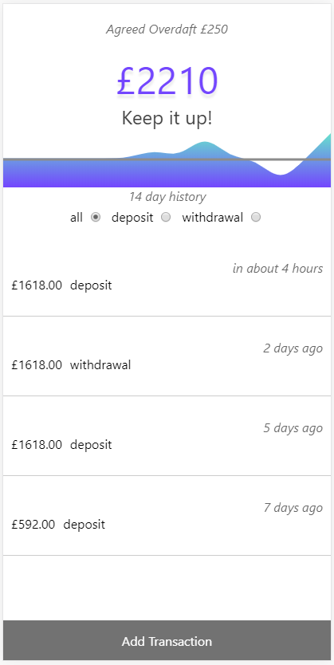
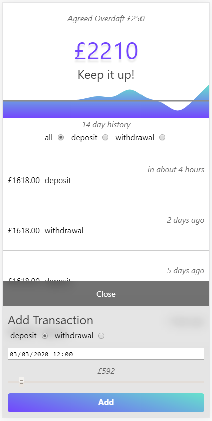
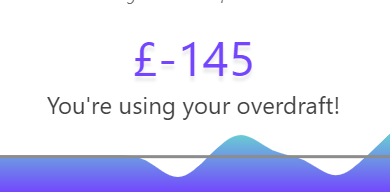
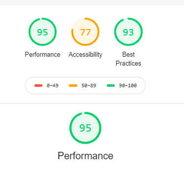

# Ledger app

## Todo (a fair amount!)

- Add e2e tests for critical flows
  - Use testcafe
- Test reducer logic
  - use Jest
  - The Reducer is tiny so it will be cheap to get good coverage.
- Extract all styles into styled-components for runtime performance and cross browser compatibility.
  - For quicker prototyping inline (style) was used and later extracted into styled-components
  - Also for consistency
- Better UX for transaction rejection
  - It would be ideal to block any further transactions until the user has dismissed some kind of rejection UI.
- Replace input datetime-local with anything else (such a bad ux on desktop)
- Move static theme object to styled-components theme provider
- Fix initial buggy animation for chart
  - The d3 area is always going from 0 -> height. We should check if all the day groupings are empty.
- Investigate the use of a service worker to enable the application to be offline first and installable.

## Screens

  

## Audit

